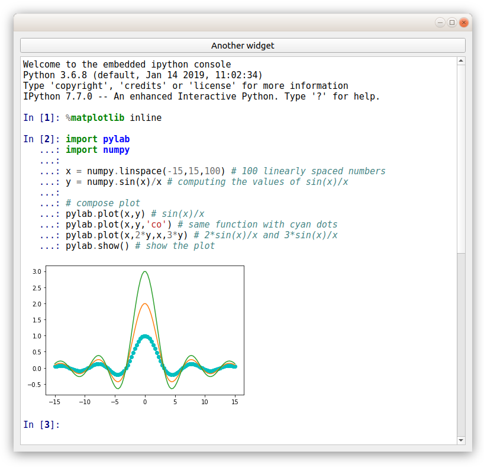

# Embedding IPython into Qt 5 Application

A demo based on [StackOverflow example](https://stackoverflow.com/questions/11513132/embedding-ipython-qt-console-in-a-pyqt-application).



## Prerequisites for Ubuntu 18.04

Prepare the virtual environment:

```
sudo apt-get install python3-venv
python3 -m venv .
source bin/activate
```

Install Python dependencies:

```
pip install wheel
pip install ipykernel==4.6.1 qtconsole
pip install PyQt5
```

## Prerequisites for MSYS2 32-bit

Prepare the Python environment (we don't use venv due to packages problems):

```
pacman -S python3 python3-pip mingw32/mingw-w64-i686-zeromq msys/libcrypt-devel mingw32/mingw-w64-i686-python3-pyqt5 mingw32/mingw-w64-i686-python3-pyzmq --disable-download-timeout
pip3 install wheel cython
pip3 install ipykernel==4.6.1 qtconsole
```

## Deployment on Ubuntu 18.04

Additionally, install matplotlib, which we will use for illustration:

```
pip install matplotlib
```

Launch the IPython Qt application example:

```
python ./example.py
```

## Deployment on MSYS2 32-bit

Additionally, install matplotlib, which we will use for illustration:

```
pacman -S mingw-w64-i686-python3-matplotlib --disable-download-timeout
```

Launch the IPython Qt application example:

```
PYTHONPATH=/usr/lib/python3.7/site-packages/ python3 ./example.py
```

## Standalone executable

A standalone executable could be created with Nuitka:

```
pip install nuitka
python -m nuitka --standalone --recurse-all --show-progress --show-modules --plugin-enable=qt-plugins --include-package=pygments.lexers --include-package=pygments.styles --include-package=ipykernel.datapub --include-package=zmq.utils --include-package=pip --include-package=wheel --output-dir=x86_64-linux-python-3.6 example.py
```
